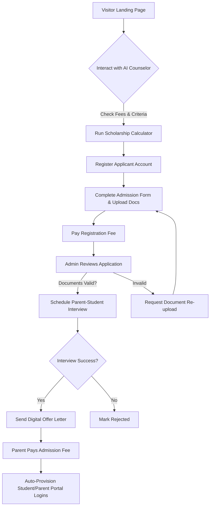
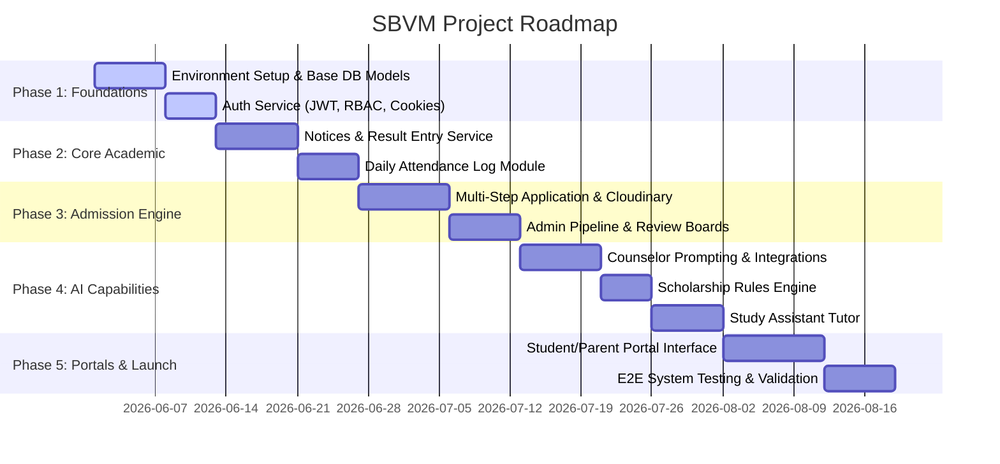

# Software Architecture Document (SAD)
## SBVM School Platform (Saraswati Bal Vidya Mandir)

This document outlines the production-ready architecture, workflows, data models, and roadmap for the **SBVM School Platform**—a SaaS-like, modern school administration and management system designed to elevate school operations, student/parent engagement, and admissions to institutional excellence.

---

## 1. Project Vision
Traditional school websites are static brochures that fail to capture the dynamic nature of school life, leaving parents in the dark, students disconnected, and administration staff bogged down by manual paperwork. 

The **SBVM School Platform** changes this paradigm by combining a modern, visually stunning public presence with a deeply integrated administrative core. By incorporating AI-driven enrollment counseling, predictive scholarship evaluations, personal study companions, and unified dashboard access, this platform transitions school operations from paper-and-spreadsheet management to an intelligent, automated, and unified digital ecosystem.

```
+-----------------------------------------------------------------------------+
|                                SBVM PORTAL                                  |
|   +---------------------------------------------------------------------+   |
|   |                       Modern Frontend App                           |   |
|   |  (React, Tailwind CSS, Vite - Sleek Dark/Light Modes, Interactive)   |   |
|   +---------------------------------------------------------------------+   |
|                                     |                                       |
|                                REST APIs                                    |
|                      (Role-Based Access, JWT, JSON)                         |
|                                     |                                       |
|   +---------------------------------------------------------------------+   |
|   |                         Backend Controller                          |   |
|   |                    (Node.js, Express, Middleware)                   |   |
|   +---------------------------------------------------------------------+   |
|        |                            |                           |           |
|  AI Services (Gemini)      DB (MongoDB Atlas)      Media (Cloudinary)       |
+-----------------------------------------------------------------------------+
```

---

## 2. User Roles & RBAC Matrix
The platform implements strict Role-Based Access Control (RBAC) across five distinct user roles:

| Role | Description | Access Scope |
|---|---|---|
| **Guest / Applicant** | Prospective parents and students visiting the public site. | Public pages, AI Admission Counselor, Scholarship Estimator, Online Admission Form. |
| **Student** | Enrolled school pupils. | Student Portal, AI Study Assistant, Result Card Viewer, Academic Noticeboard. |
| **Parent** | Parents or guardians of enrolled students. | Parent Portal, Child Progress Tracker, Attendance Logs, Fee/Dues Portal, Notices. |
| **Teacher** | Academic staff members. | Student Attendance Tracker, Marks Entry System, Student Profiles, Noticeboard (Write/View). |
| **Admin** | System administrators, school registrars, and principal office. | Admin Dashboard, Admission Review Pipeline, Fee/Dues Management, Notice Management, Teacher/Staff Management, System Logs. |

---

## 3. Functional Requirements

### 3.1 Public School Website & Engagement
- **Dynamic Homepage**: High-performance, modern landing page with immersive media, marquee alerts for notices, and structural metrics (student count, faculty count, board success rates).
- **AI Admission Counselor**: A 24/7 interactive chat agent trained on school history, board affiliation (CBSE), curriculum, infrastructure, and fee models.
- **Scholarship Eligibility System**: A smart calculator that determines fee concession slabs based on inputs (academic records, entrance test scores, parental income levels).

### 3.2 Online Admission Pipeline
- **Admission Portal**: A multi-step application form supporting draft saves, digital signature submission, and document uploads.
- **Review Dashboard (Admin)**: Workflow boards (Kanban-style) to transition applicants through pipeline phases: `Submitted` ➔ `Documents Verified` ➔ `Interview Scheduled` ➔ `Offered` ➔ `Accepted` / `Rejected`.
- **Auto-Account Provisioning**: Upon payment of the admission fee, the system automatically creates associated Student and Parent user profiles, sending credentials via SMS/Email.

### 3.3 Core Academic & Portal Modules
- **Result & Report Card Management**: Portal for teachers to input marks by subject and term. Auto-calculates percentages, ranks, and outputs dynamic, printable PDF report cards.
- **Attendance Registry**: Daily attendance input by teachers, visible immediately to parents via real-time dashboard notifications.
- **Notice Management**: Internal noticeboard system allowing target-audience filters (e.g., publish a notice only to Parents of Class 10).
- **AI Study Assistant**: Sandbox study helper for students. Supports context-guided prompts based on the student's grade/curriculum, explaining complex topics and generating self-assessment quizzes.

---

## 4. Non-Functional Requirements

### 4.1 Performance & Reliability
- **Frontend Load Speeds**: Vite-optimized builds, dynamic component lazy loading, and asset delivery via Cloudinary CDN to ensure PageSpeed scores of >90.
- **Availability**: Backend target uptime of 99.9% on Render, backed by multi-region replica redundancy via MongoDB Atlas.
- **Scalability**: Stateless API design allows auto-scaling of backend containers on Render based on traffic spikes (e.g., during result releases or admission deadlines).

### 4.2 Security & Compliance
- **Authentication**: JWT access tokens (short-lived, 15m) + secure, HttpOnly, SameSite cookies for refresh tokens (long-lived, 7d).
- **Data Protection**: Encryption at rest (MongoDB Atlas) and in transit (SSL/TLS enforced everywhere).
- **Resource Protection**: API rate-limiting on sensitive routes (e.g., authentication, AI calls) using `express-rate-limit`.

### 4.3 Design & UX Standards
- **Aesthetics**: Premium Glassmorphism styling, a refined dark/light color palette (curated HSL palettes, not generic primaries), consistent typography (e.g., Google Fonts Outfit/Inter), and smooth micro-animations.
- **Responsiveness**: Complete mobile-first responsiveness using TailwindCSS container queries and flex/grid systems.

---

## 5. Core User Stories

### Guest / Applicant
- **US-101**: As a prospective parent, I want to chat with the AI Admission Counselor to quickly learn about CBSE curriculum support, school timings, and transportation options.
- **US-102**: As a prospective applicant, I want to input my previous class scores and parent income into the scholarship tool to see if I qualify for a fee concession.
- **US-103**: As a parent, I want to submit an online admission form, upload transcripts, and save my draft midway so that I don't lose progress.

### Student
- **US-201**: As a student, I want to log in and view my customized dashboard showing recent homework, upcoming tests, and class announcements.
- **US-202**: As a student, I want to query the AI Study Assistant to explain a complex physics concept (e.g., Electromagnetic Induction) matching my Grade 12 CBSE curriculum.
- **US-203**: As a student, I want to view and download my term report cards as formatted PDFs.

### Parent
- **US-301**: As a parent, I want to view my child's daily attendance calendar to ensure they reached school safely.
- **US-302**: As a parent, I want to see a chronological dashboard of notices targetted at my child's class so I stay updated on school events.
- **US-303**: As a parent, I want to view pending fee schedules and complete payment simulation online to settle school dues.

### Teacher & Administrator
- **US-401**: As a teacher, I want a simple grid interface to register daily class attendance in under two minutes.
- **US-402**: As a teacher, I want to input exam marks for my subjects and have the system calculate total marks and grade ranks automatically.
- **US-501**: As an admin, I want to drag and drop admission applicants across a visual pipeline board (from review to offer) to streamline enrollment.
- **US-502**: As an admin, I want to draft a new circular and select "Parents only" to keep the communication channel focused.

---

## 6. Database Schema Design (Mongoose)

We will use MongoDB Atlas. Below are the structured Mongoose schemas written in TypeScript format.

### 6.1 User & Auth Schema (`users`)
```typescript
import { Schema, model } from 'mongoose';

const UserSchema = new Schema({
  email: { type: String, required: true, unique: true, lowercase: true, trim: true },
  phone: { type: String, required: true },
  passwordHash: { type: String, required: true },
  role: { type: String, enum: ['Admin', 'Teacher', 'Student', 'Parent', 'Guest'], default: 'Guest' },
  isActive: { type: Boolean, default: true },
  profileRef: { type: Schema.Types.ObjectId, refPath: 'roleRefModel' },
  roleRefModel: { type: String, required: true, enum: ['AdminProfile', 'TeacherProfile', 'StudentProfile', 'ParentProfile', 'ApplicantProfile'] },
  lastLogin: { type: Date }
}, { timestamps: true });
```

### 6.2 Profiles (`student_profiles`, `parent_profiles`, `applicant_profiles`)
```typescript
const StudentProfileSchema = new Schema({
  user: { type: Schema.Types.ObjectId, ref: 'User', required: true },
  admissionNumber: { type: String, unique: true, sparse: true },
  rollNumber: { type: String },
  firstName: { type: String, required: true },
  lastName: { type: String, required: true },
  dob: { type: Date, required: true },
  gender: { type: String, enum: ['Male', 'Female', 'Other'], required: true },
  currentClass: { type: String, required: true }, // e.g., "Class 10"
  section: { type: String, default: 'A' },
  parent: { type: Schema.Types.ObjectId, ref: 'ParentProfile', required: true },
  attendanceRecords: [{
    date: { type: Date, required: true },
    status: { type: String, enum: ['Present', 'Absent', 'Late', 'Excused'], required: true }
  }]
}, { timestamps: true });

const ParentProfileSchema = new Schema({
  user: { type: Schema.Types.ObjectId, ref: 'User', required: true },
  fatherName: { type: String, required: true },
  motherName: { type: String, required: true },
  occupation: { type: String },
  emergencyContact: { type: String, required: true },
  address: {
    street: String,
    city: String,
    state: String,
    zipCode: String
  },
  children: [{ type: Schema.Types.ObjectId, ref: 'StudentProfile' }]
}, { timestamps: true });

const ApplicantProfileSchema = new Schema({
  firstName: { type: String, required: true },
  lastName: { type: String, required: true },
  dob: { type: Date, required: true },
  gender: { type: String, required: true },
  parentName: { type: String, required: true },
  parentEmail: { type: String, required: true },
  parentPhone: { type: String, required: true },
  previousSchool: { type: String },
  previousClass: { type: String },
  appliedClass: { type: String, required: true },
  marksPercentage: { type: Number },
  scholarshipCategory: { type: String },
  feeConcessionPercentage: { type: Number, default: 0 },
  documents: {
    birthCertificateUrl: String,
    previousReportCardUrl: String,
    parentIncomeProofUrl: String,
    passportPhotoUrl: String
  },
  status: { 
    type: String, 
    enum: ['Draft', 'Submitted', 'DocumentsVerified', 'InterviewScheduled', 'Offered', 'Accepted', 'Rejected'], 
    default: 'Draft' 
  },
  interviewDate: { type: Date },
  adminNotes: { type: String }
}, { timestamps: true });
```

### 6.3 Academic & Messaging Schemas (`results`, `notices`)
```typescript
const ResultSchema = new Schema({
  student: { type: Schema.Types.ObjectId, ref: 'StudentProfile', required: true },
  class: { type: String, required: true },
  academicYear: { type: String, required: true }, // e.g., "2026-2027"
  term: { type: String, enum: ['Quarterly', 'Half-Yearly', 'Annual'], required: true },
  subjects: [{
    subjectName: { type: String, required: true },
    theoryMarks: { type: Number, required: true },
    practicalMarks: { type: Number, default: 0 },
    maxMarks: { type: Number, default: 100 },
    grade: { type: String }
  }],
  totalPercentage: { type: Number, required: true },
  overallGrade: { type: String },
  remarks: { type: String },
  publishedAt: { type: Date, default: Date.now }
}, { timestamps: true });

const NoticeSchema = new Schema({
  title: { type: String, required: true },
  content: { type: String, required: true },
  category: { type: String, enum: ['Academic', 'Event', 'Exam', 'Admission', 'General'], default: 'General' },
  targetAudience: [{ type: String, enum: ['All', 'Admin', 'Teacher', 'Student', 'Parent'] }],
  targetClass: { type: String }, // Optional, filter notices by specific class (e.g. "Class 12")
  attachmentUrl: { type: String }, // Cloudinary file link
  publishedBy: { type: Schema.Types.ObjectId, ref: 'User', required: true },
  expiryDate: { type: Date }
}, { timestamps: true });
```

---

## 7. Entity Relationship Explanation
The platform utilizes a structured relational approach within MongoDB, optimizing query paths for specific portals:

```mermaid
erDiagram
    User ||--|| StudentProfile : "has profile (if Student)"
    User ||--|| ParentProfile : "has profile (if Parent)"
    User ||--|| TeacherProfile : "has profile (if Teacher)"
    User ||--|| AdminProfile : "has profile (if Admin)"
    ParentProfile ||--o{ StudentProfile : "guards / sponsors"
    StudentProfile ||--o{ Result : "receives"
    User ||--o{ Notice : "publishes"
    ApplicantProfile ||--o? User : "promoted to (after accept)"
```

- **Polymorphic Profile References**: The `User` collection acts as a central authentication directory. It points dynamically to specific profile collections using `profileRef` and `roleRefModel` (e.g., dynamically referencing `StudentProfile` or `ParentProfile`).
- **Parent-Child Link**: A direct `One-to-Many` relational link connects `ParentProfile` (`children` array) to multiple `StudentProfile` documents, allowing parents to switch context and track dashboard data for multiple siblings from a single login session.
- **Admission Promotion**: Once an admin changes an `ApplicantProfile` status to `Accepted` and initial fees are processed, a background transaction automatically spawns a `ParentProfile` and one or more `StudentProfile` documents, linked to new `User` credentials.

---

## 8. API Architecture (REST Endpoints)

All endpoints conform to clean JSON API standards. They are prefixed with `/api/v1`.

### 8.1 Auth Module (`/api/v1/auth`)
- `POST /register-applicant` - Initial registration for prospective parents.
- `POST /login` - Generic user login. Returns JWT token and User payload. Sets HttpOnly Refresh cookie.
- `POST /refresh-token` - Generates a new access token using the refresh cookie.
- `POST /logout` - Clears refresh cookie and invalidates session.

### 8.2 Admissions Module (`/api/v1/admissions`)
- `POST /apply` - Create/Submit admission application form.
- `GET /my-application` - Fetch applicant's application.
- `PUT /save-draft` - Save partial application state.
- `GET /applications` - (Admin only) Fetch all applications with pipeline filtering.
- `PATCH /applications/:id/status` - (Admin only) Update status (interview dates, offer letters).

### 8.3 Academic & Portal Module (`/api/v1/portal`)
- `GET /student/dashboard` - Dashboard details: attendance percentages, recent results, and specific notices.
- `GET /parent/dashboard` - Comprehensive progress cards of linked children.
- `GET /notices` - Fetch notices filtered by user role and child's class.
- `POST /results/upload` - (Teacher only) Batch submit class report cards.
- `POST /attendance/log` - (Teacher only) Log attendance metrics for a selected class.

### 8.4 AI & Calculator Module (`/api/v1/ai`)
- `POST /admission-counselor` - Send message to LLM counselor engine.
- `POST /study-assistant` - Send curriculum-guided query to AI study tutor.
- `POST /scholarship-estimator` - Query rules engine for concession brackets.

---

## 9. Folder Structure (Monorepo Blueprint)

The codebase is structured logically, splitting frontend React components from backend REST services.

```
/sbvm-school-platform
│
├── /backend
│   ├── /src
│   │   ├── /config          # DB, Cloudinary, Gemini API configurations
│   │   ├── /controllers     # Controllers extracting request parameters and sending responses
│   │   ├── /middlewares     # Auth verification (JWT), RBAC verification, rate-limiters
│   │   ├── /models          # Mongoose Schemas (User, Student, Applicant, etc.)
│   │   ├── /routes          # Express endpoints grouped by module
│   │   ├── /services        # Core business logic (AI prompt wrapper, scholarship evaluator)
│   │   └── /utils           # PDF generators, logger, helpers
│   ├── server.js            # Express application bootstrapping
│   ├── package.json
│   └── .env.example
│
├── /frontend
│   ├── /public              # Static assets
│   ├── /src
│   │   ├── /assets          # Global styles, logos, images
│   │   ├── /components      # Reusable UI components (buttons, inputs, cards)
│   │   ├── /context         # React context instances (AuthContext, ThemeContext)
│   │   ├── /hooks           # Custom React hooks (useAuth, useFetch)
│   │   ├── /layouts         # Dashboard layouts, public layouts
│   │   ├── /pages           # Dashboard views, public landing page, admission form
│   │   ├── /services        # Axios instances and API endpoint mappings
│   │   ├── /utils           # Form formatters, local storages
│   │   └── App.jsx
│   ├── tailwind.config.js
│   ├── vite.config.js
│   ├── package.json
│   └── .env.example
│
└── package.json             # Root monorepo orchestration
```

---

## 10. Authentication Flow

The system employs a high-security Access/Refresh Token cycle using JSON Web Tokens (JWT) and browser security strategies.

```
+------------+               +------------+               +---------------+
|   Client   |               | API Gateway|               | Database /    |
|  (Browser) |               |  (Backend) |               | Token Service |
+------------+               +------------+               +---------------+
      |                            |                              |
      |--- 1. POST /login -------->|                              |
      |    (email, password)       |--- 2. Validate Credentials ->|
      |                            |<-- 3. Validation Success ----|
      |                            |                              |
      |    (Issue access token     |                              |
      |     & set Refresh cookie)  |                              |
      |<-- 4. HTTP 200 ------------|                              |
      |                            |                              |
      |=== INTERACTIVE SESSION ===================================|
      |                            |                              |
      |--- 5. API Req (Auth Header)|                              |
      |       (Access Token)       |--- 6. Verify Signature ----->|
      |                            |<-- 7. Verified & RBAC OK ----|
      |<-- 8. Protected Data ------|                              |
      |                            |                              |
```

1. **Credentials Submission**: The client inputs email and password to the `/api/v1/auth/login` endpoint.
2. **Token Generation**: The server verifies the credentials and returns two tokens:
   - **Access Token**: Short lifespan (15 mins), returned in the JSON body payload. Kept in memory by the React application state.
   - **Refresh Token**: Long lifespan (7 days), set as an `HttpOnly`, `Secure`, `SameSite=Strict` cookie to prevent Cross-Site Scripting (XSS) extraction.
3. **Request Authorization**: For subsequent requests, the client attaches the Access Token in the `Authorization: Bearer <token>` header.
4. **Token Expiry & Recovery**: When the client receives a `401 Unauthorized` due to access token expiration, an Axios interceptor catches the error, automatically makes a request to `/api/v1/auth/refresh-token`, retrieves a new access token, and retries the original request.

---

## 11. Admission Workflow

The admission pipeline handles prospective visitors and takes them all the way to enrolled students.



1. **Discovery & Evaluation**: Prospective parents chat with the AI counselor, ask about curriculums, and enter test scores into the scholarship engine.
2. **Application Submission**: Once interested, they register a guest account and complete the online application, uploading files (like birth certificates and marks) to Cloudinary via the backend.
3. **Admin Verification**: Administrators filter incoming submissions on the Kanban dashboard. If documents are invalid, the status is set to `DocumentsPending`, alerting the parents.
4. **Interview & Concession Check**: When verified, an interview date is logged in the system. The admin checks AI recommendations and income reports to finalize the scholarship concession percentage.
5. **Onboarding Integration**: Upon interview success, the system sends an email with the offer letter. When the parents click the link and complete the admission fee payment, the applicant is instantly promoted, and student and parent portal access keys are distributed.

---

## 12. Student Workflow
1. **Initial Login**: Students log in with credentials sent to their parents' contact number.
2. **Dashboard Review**: View current day's schedules, notice feeds, and homework alerts.
3. **AI Learning Assist**: A student struggling with mathematics queries the AI Study Assistant, receiving customized examples matching their specific curriculum context.
4. **Report Card Analysis**: At the end of terms, students check the result board, view marks distributions, and download formal report sheets.

---

## 13. Parent Workflow
1. **Dashboard Entry**: View overview charts of their child's attendance and academic trends.
2. **Real-time Monitoring**: Receive instant push notices/notifications if their child is marked absent during class roll call.
3. **Activity Sync**: Access recent academic notices, circulars, and calendar notifications.
4. **Finances & Dues**: Review term-fee breakdown cards and simulate payments to cover tuition, books, or transport.

---

## 14. Admin Workflow
1. **Admission Desk**: Access pipeline logs to review new applicants, read AI profiles, verify documents, and schedule interviews.
2. **Academic Configuration**: Manage student rosters, assign class teachers, and input term schemas.
3. **Notice Distribution**: Broadcast central circulars to specific classes, teachers, parents, or publicly to the website homepage.
4. **Financial Oversight**: Monitor total paid/unpaid balances, check scholarship concessions, and configure fee rules.

---

## 15. AI Feature Architecture

```
+------------------+     +-------------------+     +---------------------+
|   Client App     |     |  Backend Services |     | AI Provider Engine  |
|  (React UI)      |     | (Express Server)  |     |   (Gemini API)      |
+------------------+     +-------------------+     +---------------------+
         |                         |                          |
         |-- 1. Send query ------->|                          |
         |                         |-- 2. Inject context ---> |
         |                         |      (School Prospectus/ |
         |                         |       Grade Syllabus)    |
         |                         |                          |
         |                         |-- 3. Forward request --> |
         |                         |<-- 4. Return text ------|
         |                         |                          |
         |                         |-- 5. Format & audit ---->|
         |<-- 6. Render UI --------|                          |
```

- **Core engine**: We will wrap the Gemini API (utilizing `google-genai` SDK or official HTTP endpoints) within the Node.js backend.
- **Context Injection (System Prompts)**: 
  - **AI Counselor**: System prompt loads a JSON representation of the school prospectus (Fee structure, CBSE guidelines, sports facilities, rules, dynamic class vacancies).
  - **AI Study Companion**: Injects the student's grade level and subject curriculum (e.g. CBSE Grade 10 Math syllabus) before forwarding their questions. This keeps answers accurate and age-appropriate.
- **Security & Cost Guardrails**: Rate limiters restrict each user role to a set number of queries per hour (e.g., 20 queries/hr for guests, 50 queries/hr for students) to manage API costs. Sanitizers run check-rules on incoming chat variables to block prompt-injection attacks.

---

## 16. Security Considerations
- **CORS & Headers Enforcement**: Incorporate `cors` middleware, limiting access exclusively to the Vercel production frontend domain. Use `helmet` to establish secure content security policies.
- **Data Input Cleaning**: Use `zod` to validate all input payloads before database writes, protecting the database from injection attempts.
- **XSS & CSFR Mitigations**: Avoid using `dangerouslySetInnerHTML` in React unless necessary, and sanitize user text using libraries like `dompurify`.
- **Sensitive Key Management**: Store backend environment variables (`JWT_SECRET`, `CLOUDINARY_URL`, `MONGODB_URI`, `GEMINI_API_KEY`) securely inside Vercel and Render management portals. Never commit env files.

---

## 17. Deployment & Infrastructure Architecture

```
+------------------------------------------+
|                 Vercel                   |
|        (Frontend Hosting CDN)            |
|  React SPA (HTTPS) ➔ Global Edge Nodes   |
+------------------------------------------+
                     │
         HTTPS API Requests (Restricted by CORS)
                     │
                     ▼
+------------------------------------------+
|                 Render                   |
|       (Backend App Web Service)          |
|  Stateless Node.js / Express Servers     |
+------------------------------------------+
          │                        │
  Secure MONGODB_URI       Secure API Calls
          │                        │
          ▼                        ▼
+-------------------+    +-----------------+
|   MongoDB Atlas   |    |    Cloudinary   |
| (Database Cloud)  |    |  (Media Asset)  |
+-------------------+    +-----------------+
```

- **Frontend Platform (Vercel)**: Configured for Continuous Deployment (CD) from the GitHub repository. Single Page Application (SPA) routes redirect to `index.html` to support React Router natively.
- **Backend Service (Render)**: Set up as a Node Web Service. An active healthcheck route (`/health`) monitors status, triggering auto-restarts if a service hangs.
- **Database (MongoDB Atlas)**: Set up with a primary-secondary replica architecture. Firewall access lists are restricted to Render outbound IPs or NAT gateways.
- **Asset Storage (Cloudinary)**: Handles image transformations and delivers files over a globally distributed CDN.

---

## 18. Development & Implementation Roadmap

We will divide the build schedule into logical milestones:



### Milestone 1: Core Setup & Security (Week 1-2)
- Initialize database schemas and backend config wrappers.
- Deploy registration routes and secure authentication middleware.
- Configure public Vite layout.

### Milestone 2: Document Pipelines & Admissions (Week 3-4)
- Formulate Cloudinary integration services.
- Develop student application pathways and dynamic admin pipeline dashboards.
- Incorporate scholarship logic engines.

### Milestone 3: AI Modules & Dashboards (Week 5-6)
- Integrate backend wrappers for Gemini to support counselor and study chats.
- Build marks submission engines and PDF generators.
- Construct portal pages for students and parents.

### Milestone 4: Integration, Testing & Deployment (Week 7-8)
- Run complete end-to-end integration tests.
- Deploy frontend code to Vercel and backend services to Render.
- Verify environment parameters and production stability.
